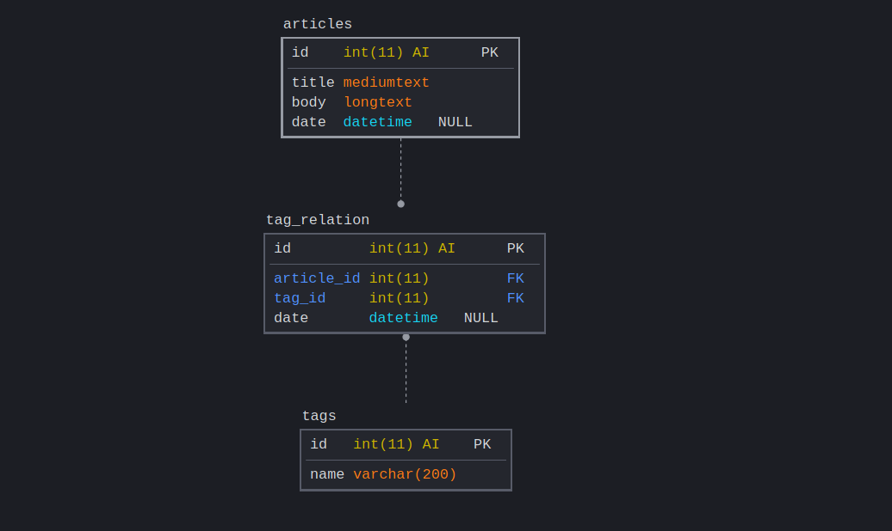

# [Example] REST API built using Go

This API exposes three endpoints.

```txt
| Method | URI                    | Description                                                 |
|--------+------------------------+-------------------------------------------------------------|
| POST   | /articles              | Create/add articles, accepts JSON data.                     |
| GET    | /articles{id}          | Returns the JSON representation of the article              |
| GET    | /tags/{tagName}/{date} | List of articles having this specific tag on the given date |
```

Example: Article detail response JSON looks like following.

```json
{
  "id": 1,
  "title": "latest science shows that potato chips are better for you than sugar",
  "date": "2016-09-22",
  "body": "some text, potentially containing simple markup about how potato chips are great",
  "tags": ["health", "fitness", "science"]
}
```

Example: Tag details response JSON: `/tags/health/20160922`

```json
{
  "id": 1,
  "tag": "health",
  "count": 17,
  "articles": [1, 7],
  "related_tags": ["science", "fitness"]
}
```

## Assumptions

I have made few assumptions to build this API.

- While creating article it is passed with tags in CSV format.
- Tags are stored in a separated table once new tag is submitted `/articles` -> `POST` request.
- Relation between newly created article and tag is stored in `tag_relation` table.
- Updating Tags from `tags` table will reflect in both `articles` and `tag_relation`.
- When an article is deleted, respective row in `tag_relation` will be deleted.

### DB Diagram



## Setup/Installation

### Pre-requisites

- `make`
  - Mac OS (`brew install make`)
  - [Windows](http://gnuwin32.sourceforge.net/packages/make.htm)
- `go` version `1.15`
- `docker` (optional)
- `docker-compose` (optional)
- `mysql` (not required if you are willing to spin it up via docker-compose)

Configuration variables are read from OS env vars. `.env.example` has all the env vars required to run the application.

### Makefile

`make` command lists all available commands.

## Start application

First of all please create `.env` file by copying contents of `.env.example`.
And fill in respective values if you wish to change them.

- `cp .env.example .env`

### Docker Compose (Recommended)

This will build the application image based on the `Dockerfile` and downloads `mysql` docker image.

- `make up`

Above command essentially runs `docker-compose` command under the hood.

### Without using Docker

You need to provide Database Credentials of your own.

- `export $(cat .env | xargs)` to manually load env vars.
  However, `make` will automatically load env vars from `.env` file.
- `make run` or `sh go run main.go`

### DB Migrations

Migrations are automatically run when starting application with docker.
For now, initial migration files are for creating database tables.
I am using [`golang-migrate`](https://github.com/golang-migrate/migrate/)
for handling all migrations.

- `make migrate-new` For creating new migration SQL file.
- `make migrate`
- `make migrate-down`

## Design Principle

Implemented `MVC` pattern for the development.

## Error Handling

I have extended `errors` package and created a custom struct sothat it fits our needs to reply error to client.

```go
type RestErr struct {
	Message string `json:"message"`
	Status  int    `json:"code"`
	Error   string `json:"error"`
}
```

Example: Create a response for bad request with `403` http status code.

```go

errors.NewBadRequestError("bad request")

```

```go

func NewBadRequestError(m string) *RestErr {
	return &RestErr{
		Message: m,
		Status:  http.StatusBadRequest,
		Error:   "bad_request",
	}
}
```

## TODOs

- [ ] Write tests
- [ ] Complete CRUD
